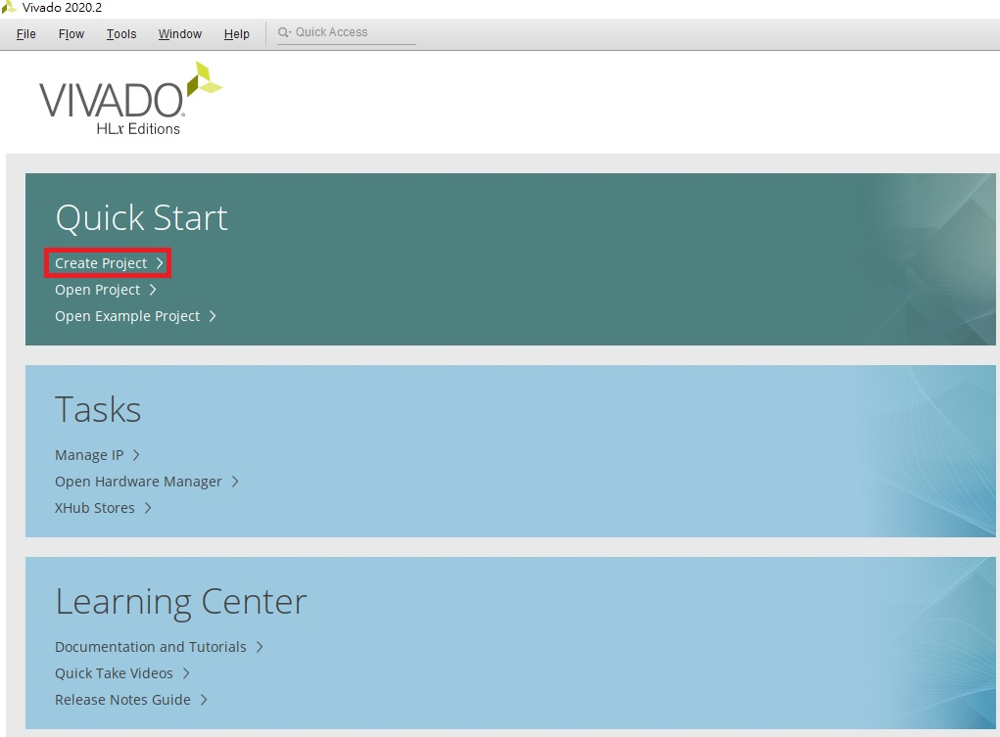
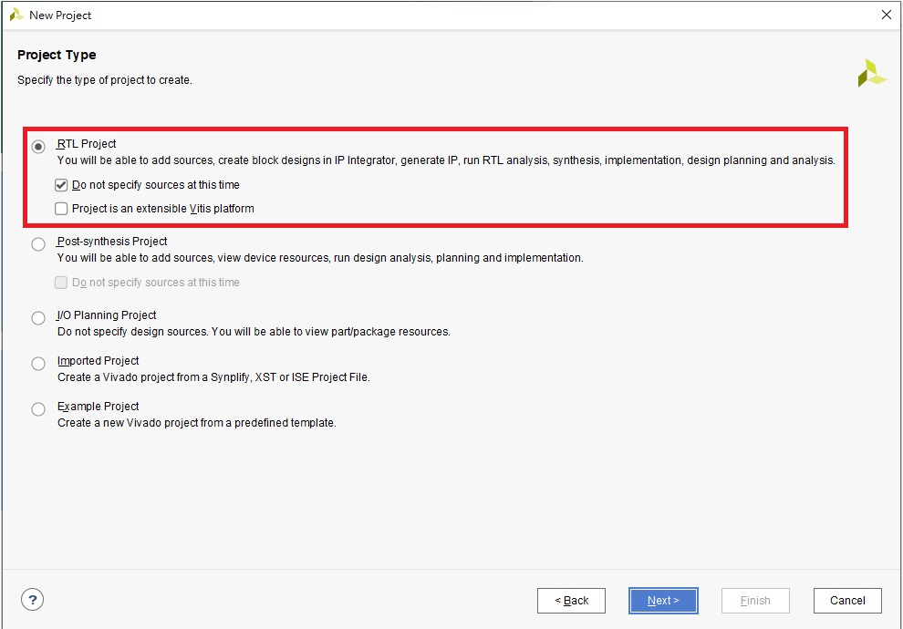
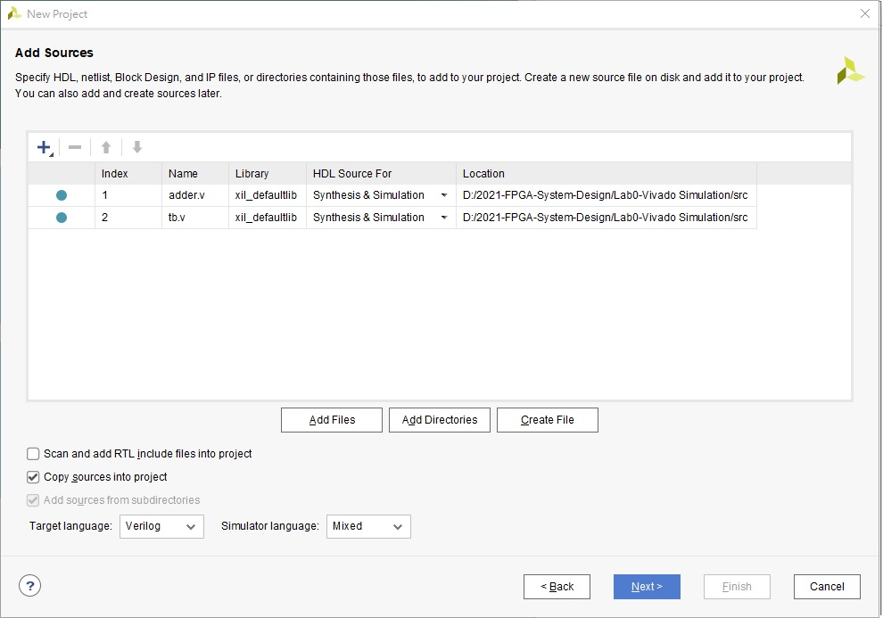
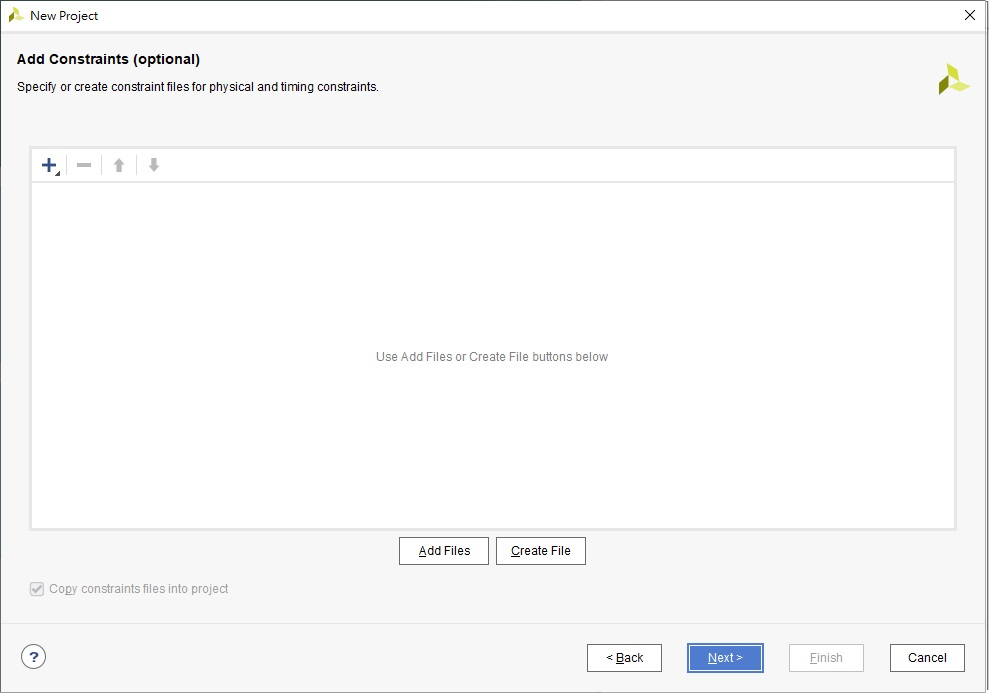
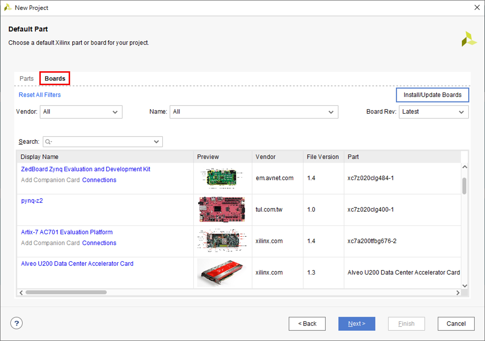
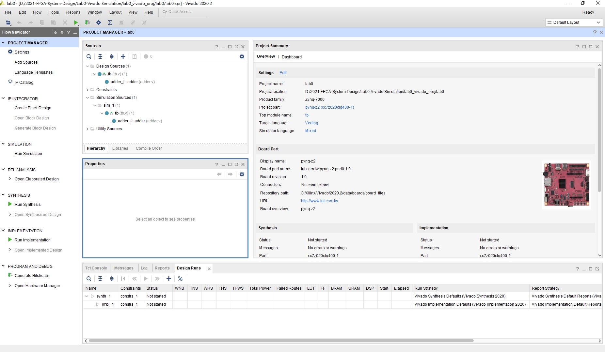
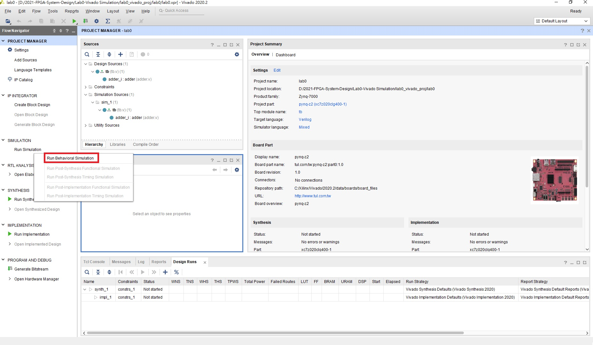
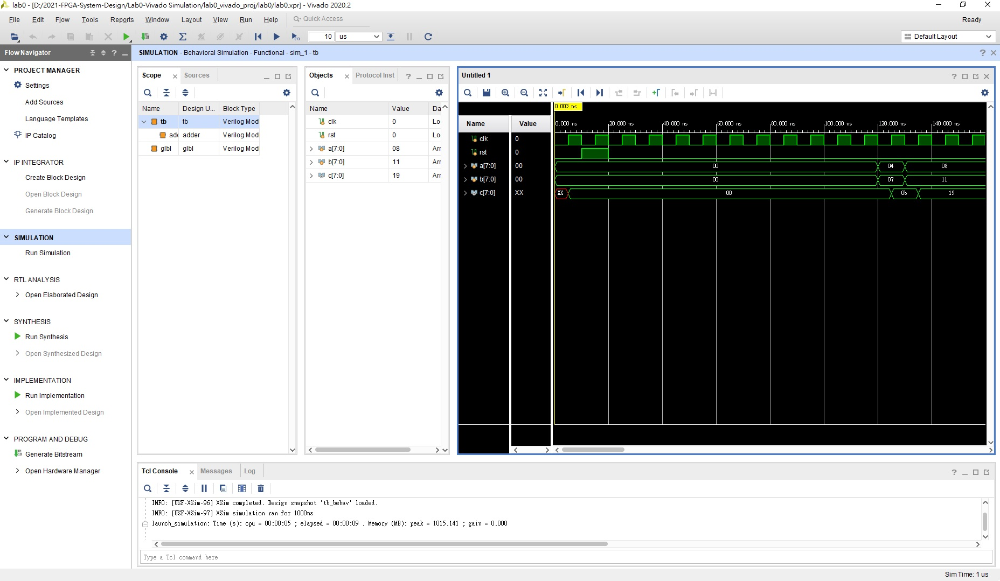

FPGA Design Lab0
===================

# Part 1 - How to Create a Project on Vivado and Run Simulation
## Purpose

本實驗目的為讓各位了解如何將設計好的電路在 Vivado 上模擬。

## Step 1. Create a new project
首先，開啟 Vivado 軟體後會出現以下介面。
> NOTE: 此為 Vivado 2020.2 介面

選擇 Create Project 選項。

  

決定 Project 路徑及名稱後選擇 Project Type 為 RTL Project。

> NOTE 1 : 檔案路徑建議不要有中文

> NOTE 2 : _"Do not specify sources at this time"_ 的勾選與否，會決定是否在 create project 的階段就加入 HDL files 及 constraint files

若沒勾選 _"Do not specify sources at this time"_ 則會進入 add sources and constraints 畫面。

> 進入Project主頁面後仍可加入檔案

在 Add Sources 選擇 Add Files 將放在 src 資料夾的 adder.v & tb.v 加入到這次的 Project 中。
> NOTE: Add Sources 加入或建立的檔案為 HDL files (硬體描述語言檔) / Simulation Files

在 Add Constraints 這步驟不選擇檔案，直接按 Next 。
> NOTE: Add Constraints 加入或建立的檔案為 xdc files ， 是用來告訴 FPGA 你的電路的 I/O 腳位對應到 FPGA 上的什麼位子，或是電路內部額外的 Port 宣告、constraint等等，這次實驗只有用到模擬功能故不需要加入 xdc files。

選擇我們要燒錄的 FPGA。

> NOTE: 本次Lab只會用到模擬功能不會到合成，因此選擇什麼板子都不影響。

一切選擇完畢後出現以下介面，代表創建完成。

## Step 2. Simulation

在 Step 1 我們已經將本次實驗所需的 RTL code 及 Testbench 加入到 Project 中，直接按下上圖 Vivado 介面左邊 PROJECT MANAGER 中間的 Run Simulation -> Run Behavior Simulation 。

點選以後，就可以看模擬的波形、訊息等等資訊。

