FPGA Design Lab1 - FPGA Implementation Flow
===================

# Part 1 - Introduction to Vivado Gui

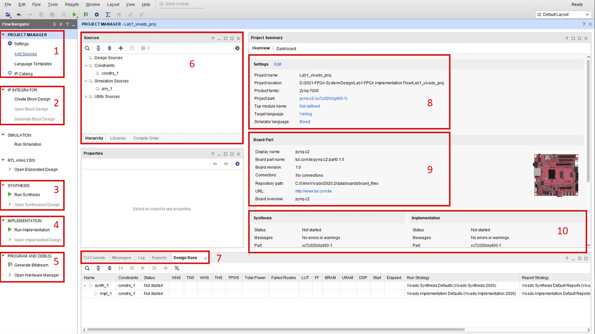

### 1. Project Manager

##### 整個 Project 的管理包括了 : 檔案管理 , 專案設定 , IP資料夾路徑等等

### 2. IP Integrator

##### 以 Block Design 的方式來兜出整個系統，且可以加入 Xilinx 或是第三方所提供的 IP 來實作整個系統的設計

### 3. Synthesis

##### 將設計好的硬體描述檔合成成 FPGA 上由 CLB , Switch Box , Embedded Element 等元件所組成的實際電路

### 4. Implementation

##### 將合成好的實際電路擺放到 FPGA 上的確切位置 (Floor & Plan)

### 5. Program And Debug

##### Generate Bitstream : 將 Implementation 完的電路編譯成一個燒錄進 FPGA 的位元串流檔

### 6. Sources

##### 管理 `Design Sources` , `Constraints` , `Simulation Sources`

### 7.

##### - Tcl Console : 使用指令的方式來實作 Project (在 GUI 上每個點選的動作其實都有相對應的一條指令，也會顯示在這邊)

##### - Message : 任何系統訊息, warning, error都會顯示在這，若在實作 project 時卡關建議先到這裡找問題。

##### - Log : 紀錄 Project 歷程

##### - Reports : 回報 synthesis & implementation 如 timimg, power, utilization 等資訊。

##### - Design Runs : 顯示軟體現在正在進行什麼步驟。

### 8. Project Summary

### 9. 當前使用之FPGA資訊

### 10. Synthesis & Implementation 之 Summary

# Part 2 - Introduction to PYNQ-Z2

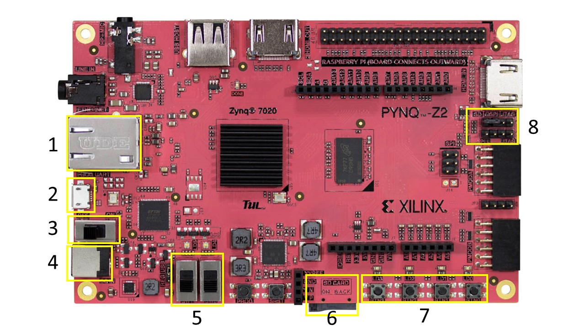

### 1. Ethernet Protocol

### 2. Micro USB / JTAG

##### 燒錄 FPGA / 小電壓電供

### 3. FPGA 開關

##### **重要！插拔電源時務必先關閉 FPGA**

### 4. DC Supply

##### 大電壓電供

### 5. Switch

### 6. SD Card

##### 可燒錄 OS image，透過 SD 卡開機 (Lab6 會使用)

### 7. Buttons

### 8. Boot Jumper

##### 用來切換 FPGA 開機模式

##### **重要！切換 Jumper 時務必先關閉 FPGA**

# Part 3 - FPGA Implementation Flow

## Step 1 - Add Source / Constraint Files

Add or create design sources : 加入 `/src` 內的 `top.v` `LED.v` `divider.v`

Add or create constraints : 加入 `/xdc` 內的 `blinky.xdc` `pynq-z2_v1.0.xdc`

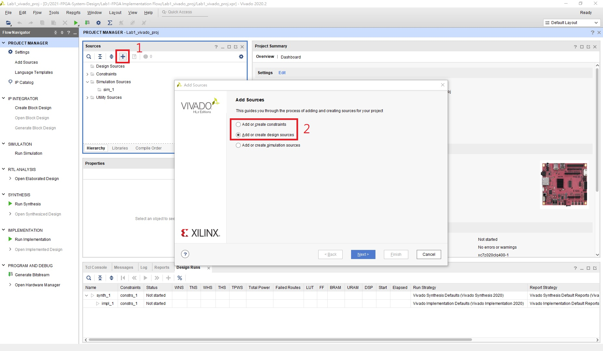

加入完成後如圖

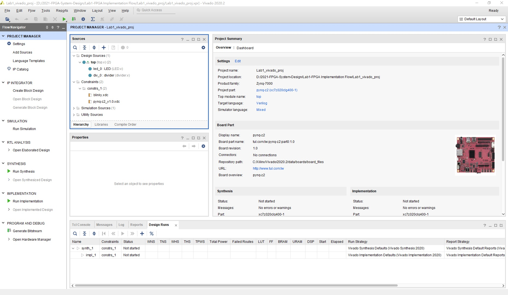

## Step 2 - Synthesis

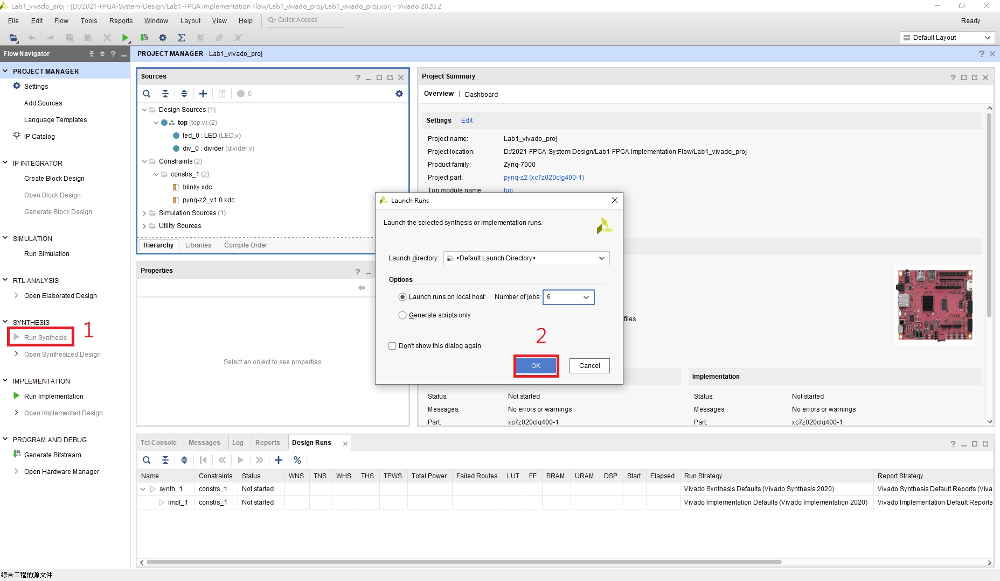

跑完後可以在左邊選單選擇想看的合成結果 (如電路圖，FPGA上使用到的模組等等)

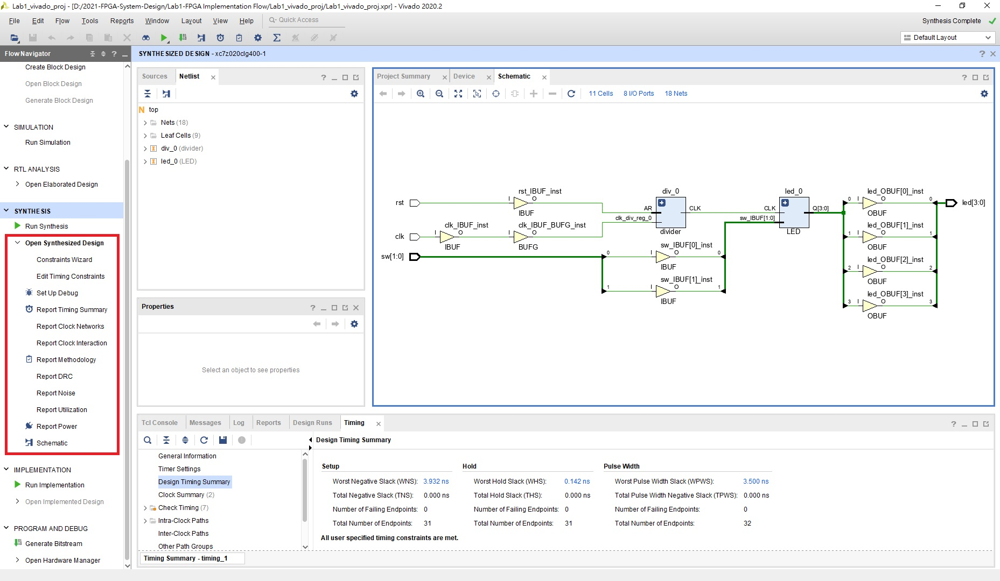

## Step 3 - Implementation

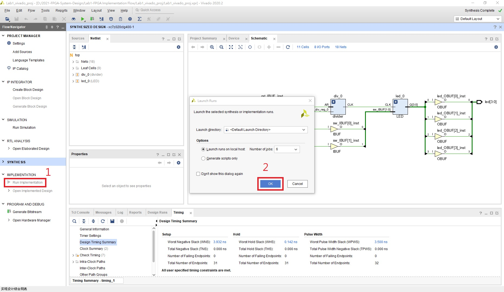

和 Synthesis 一樣，跑完可以看 Implementation 後的結果

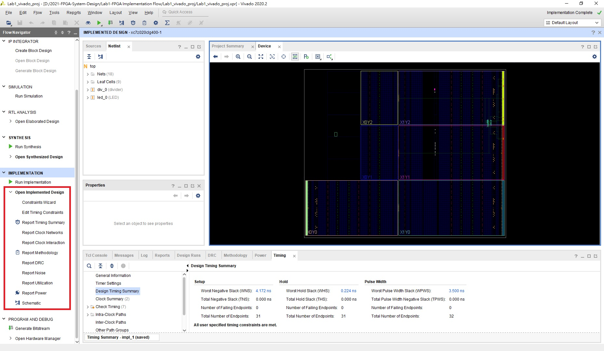

## Step 4 - Generate Bitstream

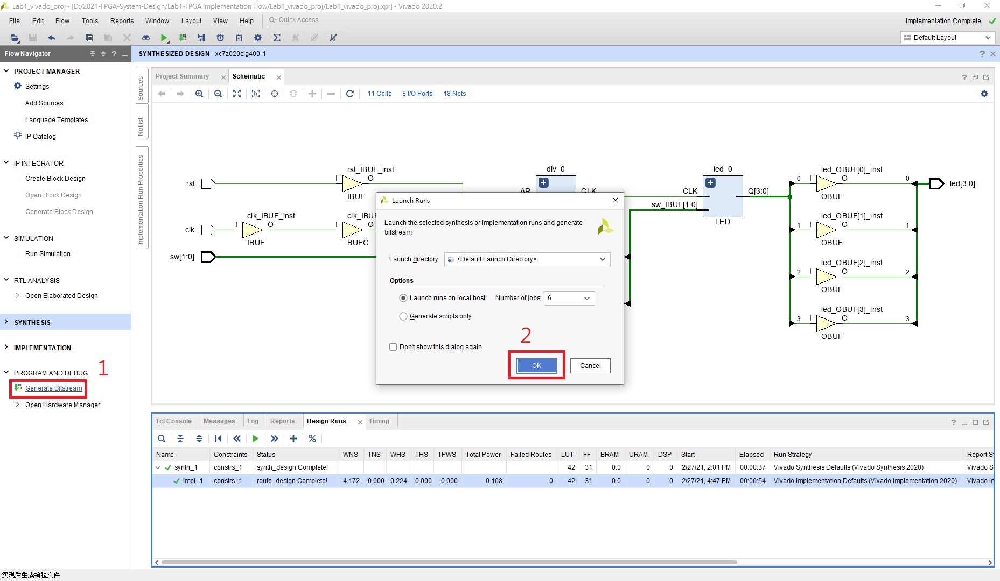

跑完後如圖操作

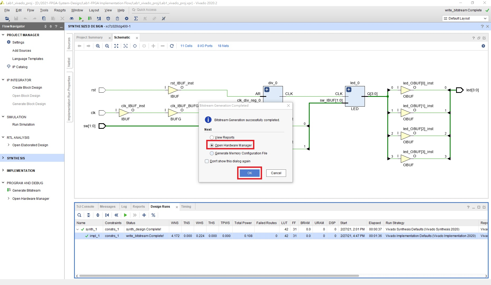

## Step 5 - Turn on FPGA

#### 1. 將 FPGA 與電腦端連接 (將 Micro USB 插上 Port 2)

#### 2. 將8號區的 Jumper 插至 `JTAG` 的位置

#### 3. 打開開關

開啟 FPGA 後如圖操作

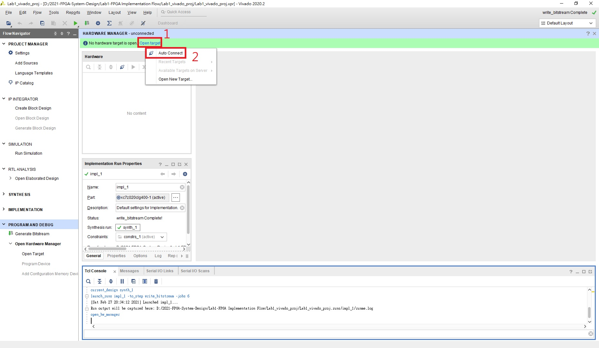

若有正確運行應該會抓到 FPGA 的資訊，按下 `Program device` 即可將生成的 bitstream 燒錄進 FPGA

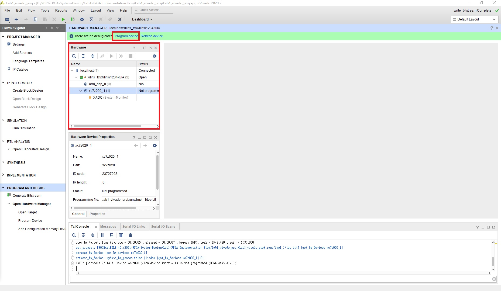

燒錄完成後請搭配提供的 RTL Code 觀察 Switch 和 LEDs 的關係
