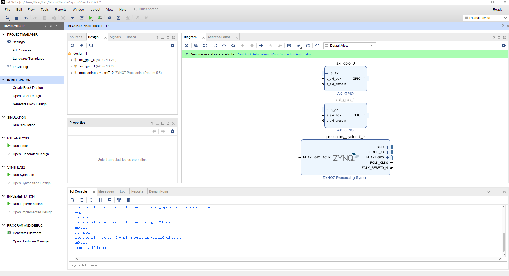
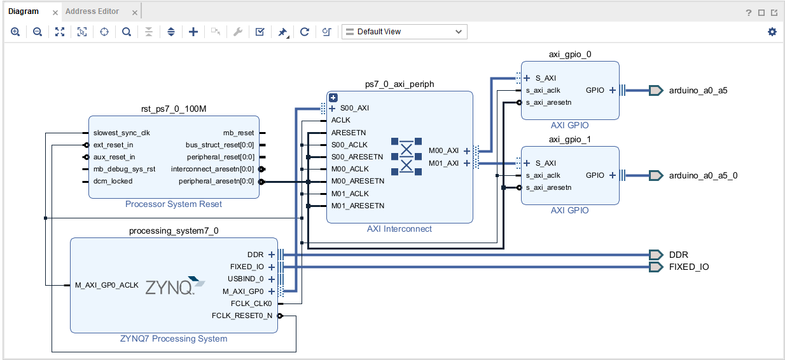
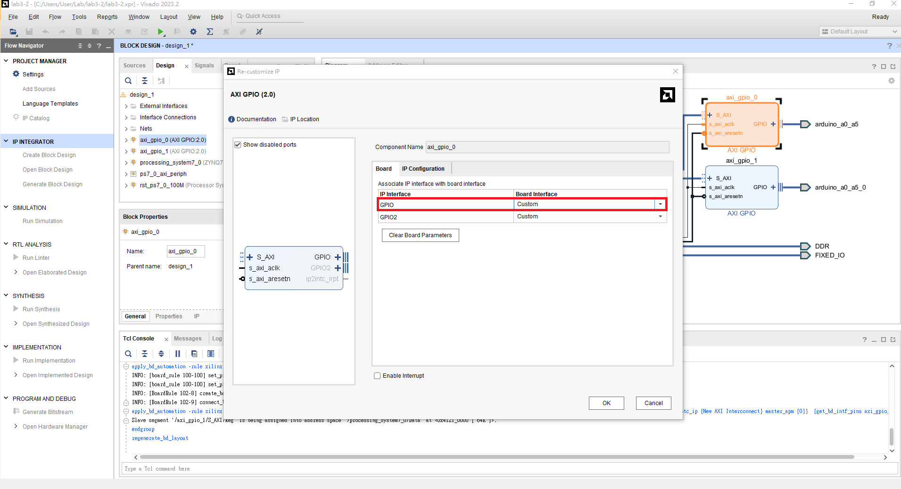
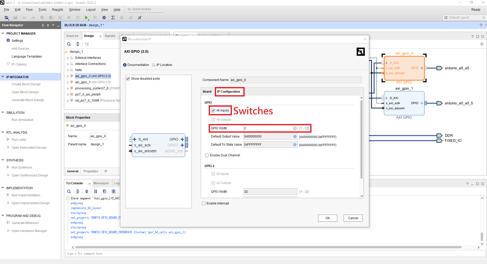
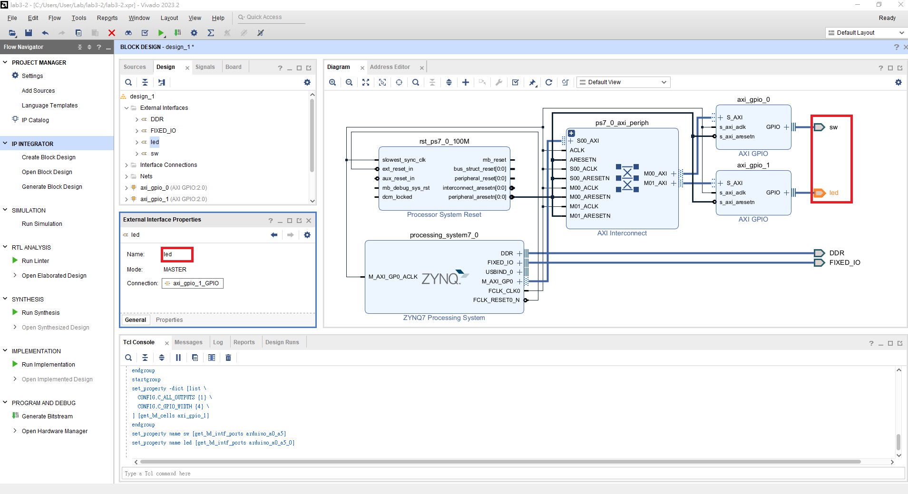
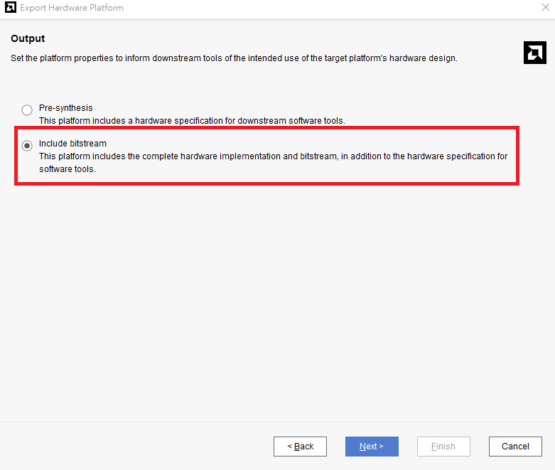
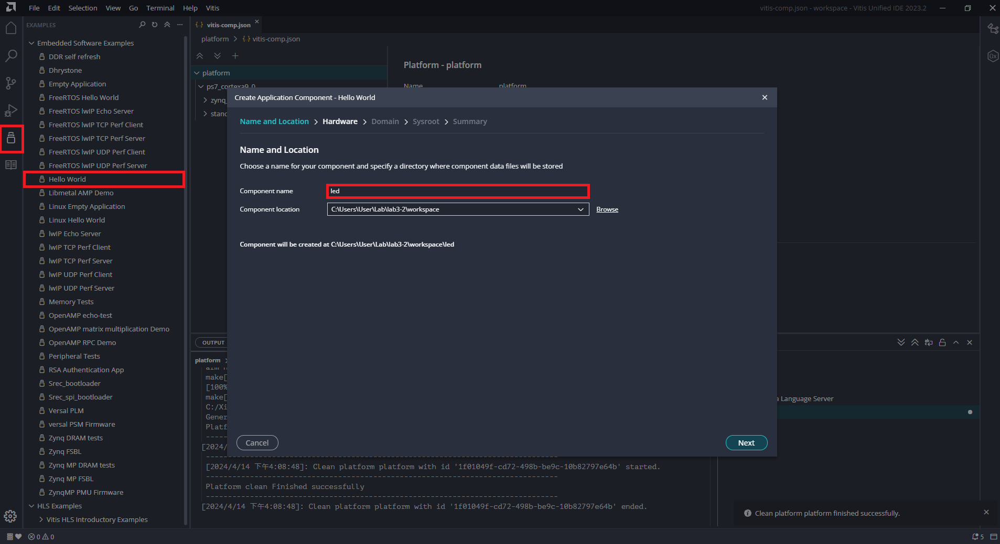
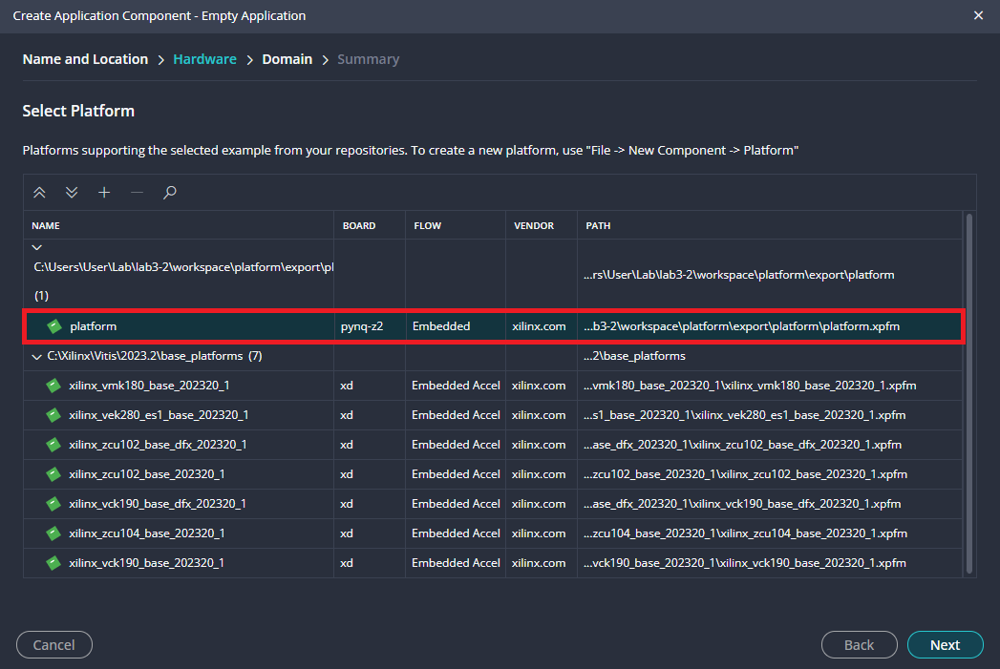

# FPGA Design Lab3-2 - Zynq Processor + AXI GPIO IP
## Purpose
使用 Zynq Processor 搭配 [AXI GPIO IP](https://xilinx.github.io/embeddedsw.github.io/gpio/doc/html/api/index.html) 控制板子上的 I/O。
## Step 1. Create a new project
僅需加入本次實驗所提供的 Constraints。
## Step 2. Create block design
本次實驗需加入三個 IP `ZYNQ7 Processing System`、`AXI GPIO*2`

Run Block Automation > OK (全部勾選)

Run Connection Automation > OK (全部勾選)

Vivado 會自動幫我們接上 AXI Interconnection 形成下圖。

>What is [AXI (Advanced eXtensible Interface)](https://www.xilinx.com/products/intellectual-property/axi.html) ?

點開 AXI GPIO IP 將 GPIO 改成 Custom (兩個 AXI GPIO IP 都要改)。

切換到 IP Configuration，分別改成以下兩個設定，兩個 GPIO 一個是接到 LEDs 一個是接到 Switches。

設定完成後，在 External Interface Properties 更改連接出去的 port name，方便辨認。

將完成的 block design 包成 HDL wrapper (Lab2-2 Step5 最後一步)。

## Step 3. Generate bitstream & Export Hardware
請回顧 Lab01 Step2

>NOTE: 不同於 lab3-1，AXI GPIO 是由 programmable logic 執行的所以需產生 bitstream 將 AXI GPIO 燒錄到 FPGA 上。

File > Export > Export Hardware。
>NOTE: 由於有產生 bitstream 所以 include bitstream 的選項需打勾。

## Step 4. Launch Vitis IDE & Write a LEDs control program
Tools > Launch Vitis IDE

回顧 lab3-1，open workspace ，並且 Create Platform Component，選擇前面產生的 XSA 檔案

利用 Example 建立完整的環境，並選擇前面完成的 platform

置換 application project 下的 Sources/src/helloworld.c 為講義中的 `Lab3-2/src/led.c`

優先 build platform

請回顧 Lab3-1 ，建立一個新的 project -> 建立空的 source file 請貼上 `Lab3-2/src/led.c` 的內容。

在執行 Run Configuration 時，由於這次有產生 bitstream 所以會多出現一個 `.bit` 檔案。

## References
 1. [Embedded System](https://zh.wikipedia.org/wiki/%E5%B5%8C%E5%85%A5%E5%BC%8F%E7%B3%BB%E7%BB%9F)
 2. [Embedded System C Program](http://stenlyho.blogspot.com/2007/04/c_03.html)
 3. [AXI BUS](https://www.twblogs.net/a/5b8cb90d2b7177188334d3a7)
