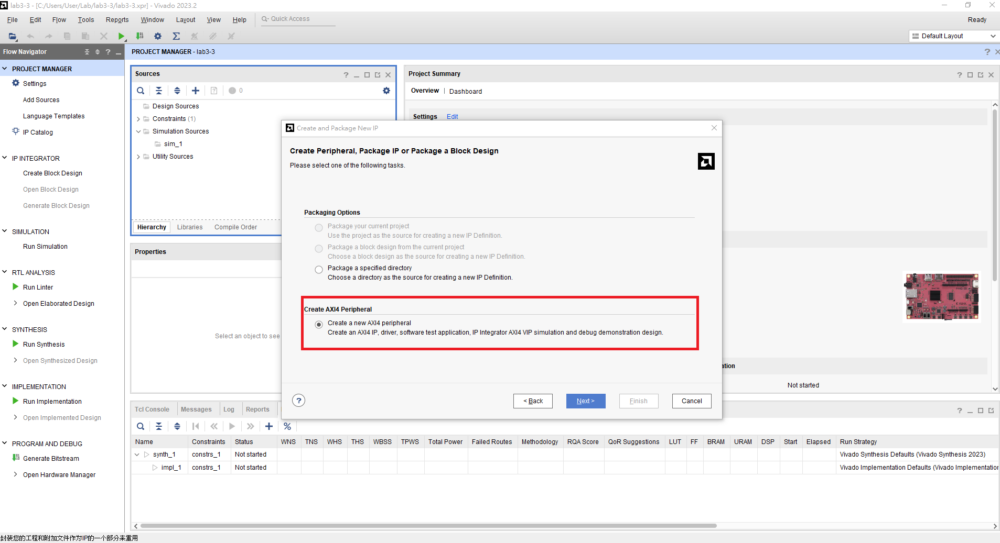
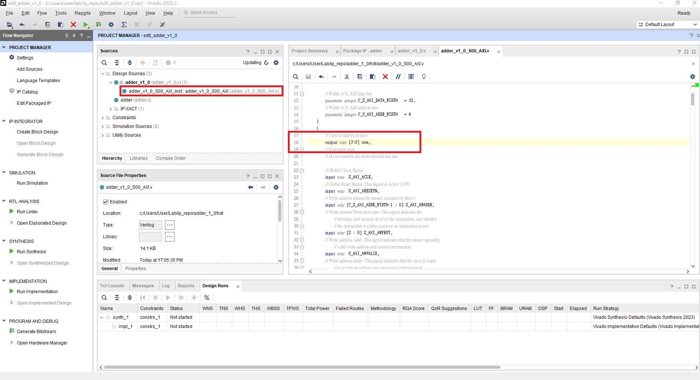
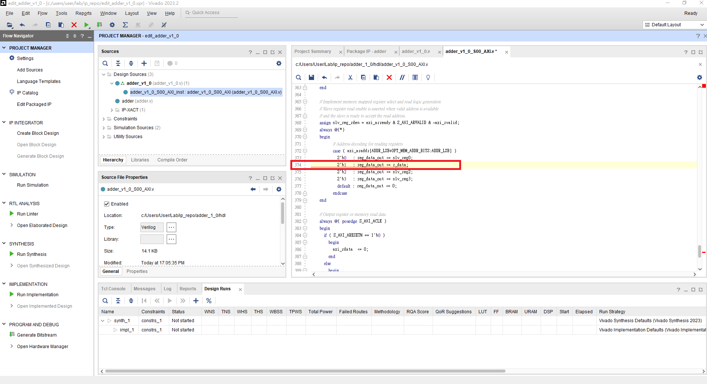
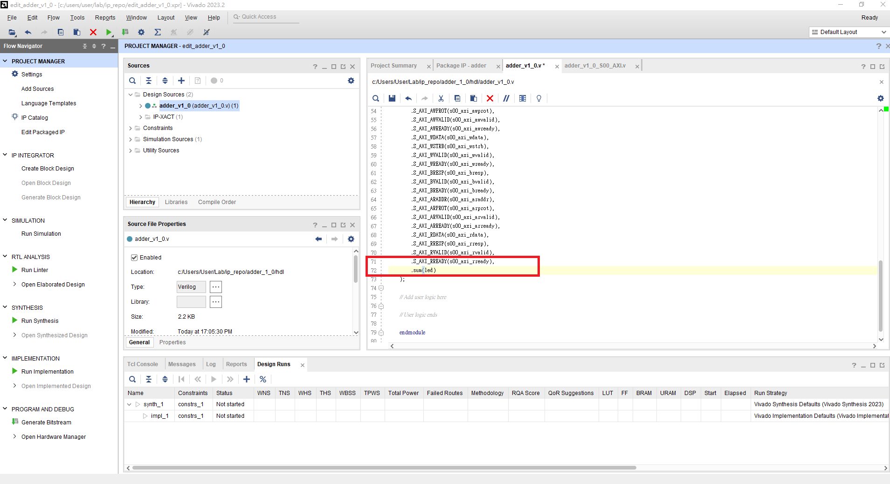
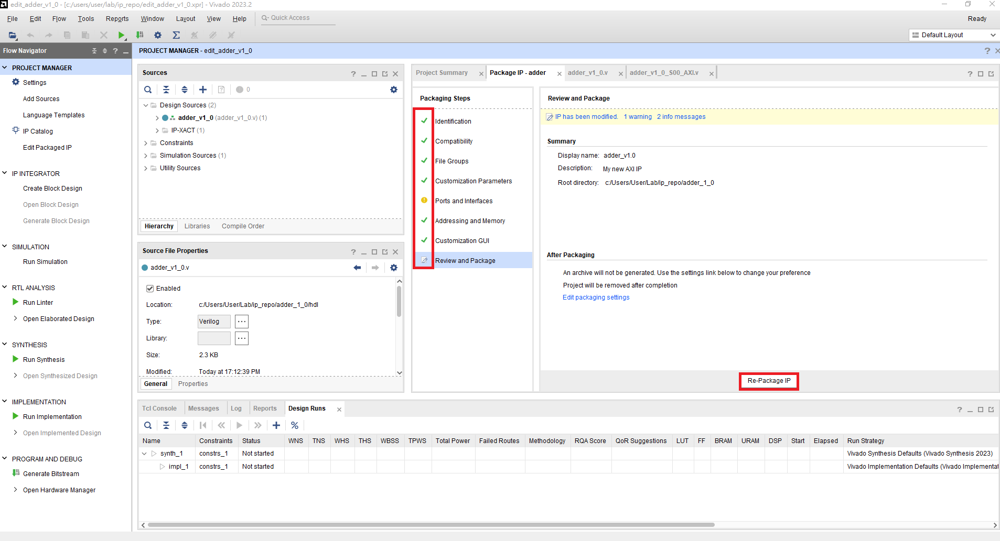
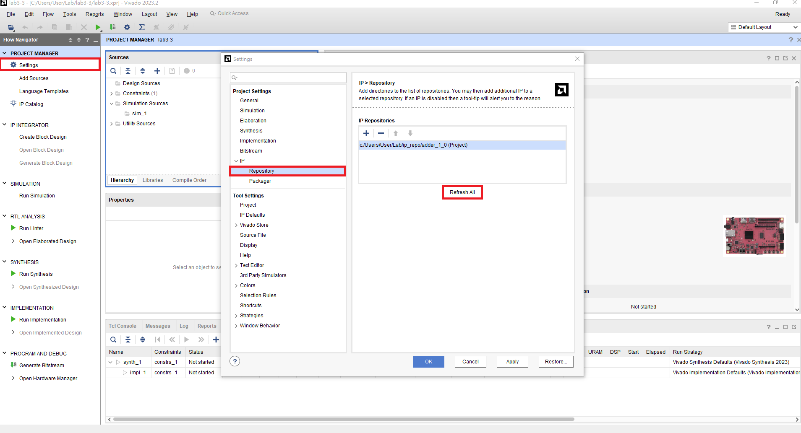

# FPGA Design Lab3-3 - Package a Custom AXI IP

## Introduction to AXI Interface

## Step 1. Create a new project

加入本實驗所提供的`.xdc`。

## Step 2. Create new IP

點選 Tools > Create and Package New IP。

接著選擇 Create a new AXI4 peripheral，取名為 adder，最後選擇 Edit IP。

創建完後加入`src/hdl/adder.v`，並修改產生的 HDL code。

>下面這些步驟主要是在連接 AXI Interface Register 和我們建立的 IP 的 I/O。 [AXI 總線簡介](https://www.twblogs.net/a/5b8cb90d2b7177188334d3a7)

HDL code 修改完後，回到 package IP 畫面將沒有打勾的部分點進去修改，最後 Package IP。

回到 create new IP 前的 project，refresh 加入的 IP。

本次實驗的 Block design。

Block design設計完後，到 Address Editor 中設定 AXI 之 base address。(右鍵 -> assign，預設為0X43C0_0000)

## Step 3. Write user IP driver and software program
Create HDL Wrapper 且產生 Bitstream 後，Export Hardware 並開啟 Vitis，建立 Project 加入檔案 `src/software/main.c`

將 `src/driver/adder_v1_0/` 內的程式複製到下圖紅色部分。

並修改 platform 中的三個 makefile:
1. platform/Sources/hw/sdt/drivers/<CustomIP_name>/src/Makefile
2. platform/Sources/ps7_cortex_a9_0/standalone_domain/bsp/hw_artifacts/drivers/<CustomIP_name>/src/Makefile
3. platform/Sources/zynq_fsbl/zynq_fsbl_bsp/hw_artifacts/<CustomIP_name>/src/Makefile

將makefile中的 `OUTS = *.o` 修改為 `OUTS=$(addsuffix .o, $(basename $(wildcard *.c)))`

除此之外，Vitis需要的是ps7_init.tcl，然而自製 ip 也有屬於自己的 tcl，因此需要到 `Settings\launch.json` 的 `Initialization file` 修正

