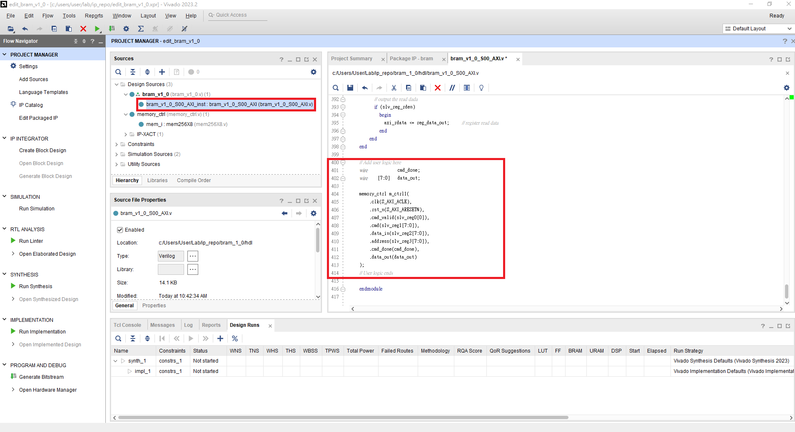
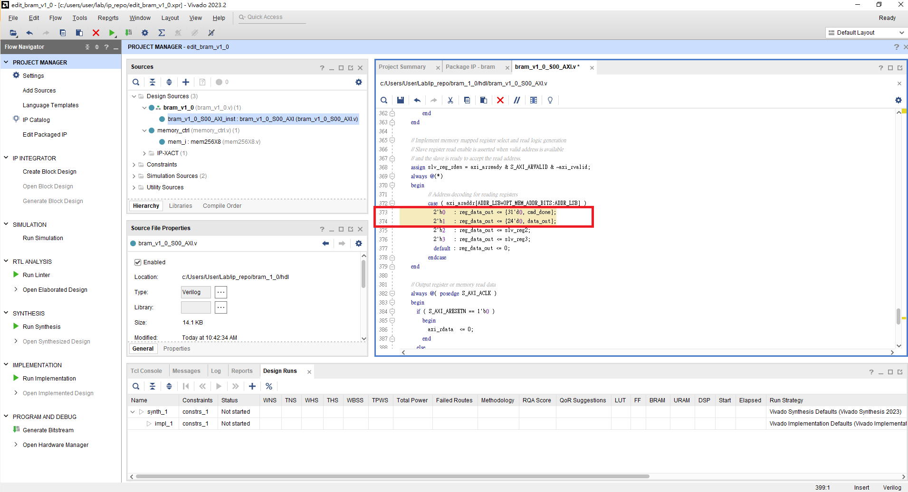
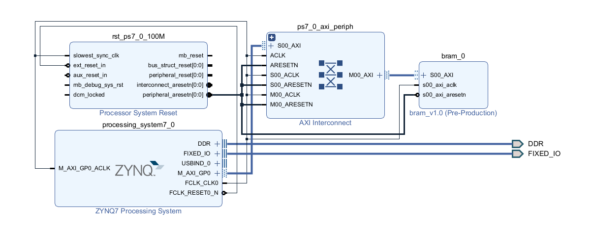
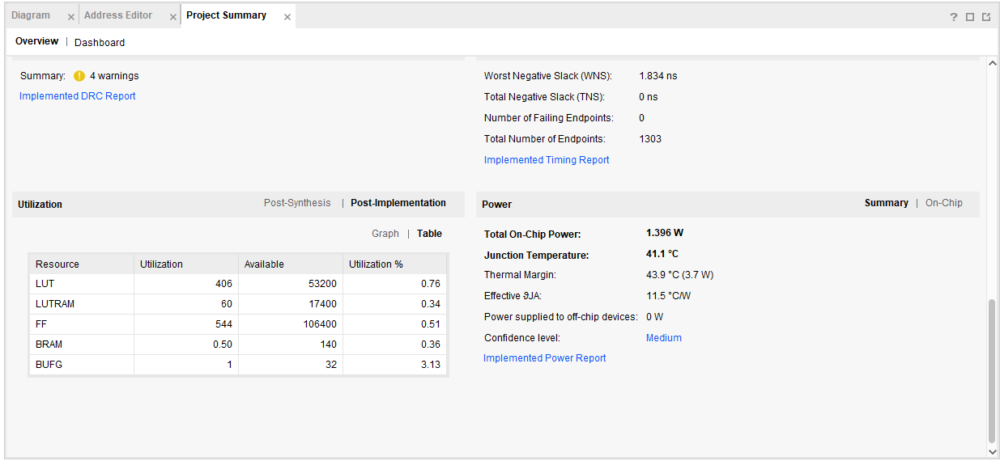
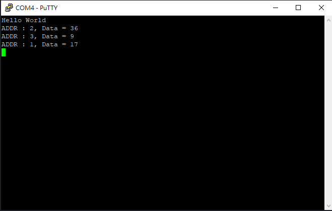

4-2 HDL Synthesis
=================

## Purpose

透過 Verilog code 來描述 Block RAM 的行為架構，使合成軟體將我們使用到的記憶單元使用 Block RAM 來合成。

## Package AXI IP

本次實驗要將 `hdl/memory_ctrl.v hdl/mem256X8.v` 包成 AXI IP。

修改 IP 內的 `YourIPName_S00_AXI.v` 如下圖。

  

  

## Block design

本次實驗的 Block Design 如下圖。

## Generate bitstream

執行 Generate Bitstream，等待完成後到 Project Summary 介面看 Implementation 後的結果，會發現 IP 內的儲存空間使用 BRAM 來合成了。

## Vitis

Export Hardware 並開啟建立 Vitis Project 後，加入 `src/main.c`

和 Lab3-3 一樣，需修改三份 Makefile 如下

1. platform/Sources/hw/sdt/drivers/<CustomIP_name>/src/Makefile

2. platform/Sources/ps7_cortex_a9_0/standalone_domain/bsp/hw_artifacts/drivers/<CustomIP_name>/src/Makefile

3. platform/Sources/zynq_fsbl/zynq_fsbl_bsp/hw_artifacts/<CustomIP_name>/src/Makefile

將makefile中的 `OUTS = *.o` 修改為 `OUTS=$(addsuffix .o, $(basename $(wildcard *.c)))`

並且到 `Settings\launch.json` 的 `Initialization file` 修正 tcl 檔為 ps7_init.tcl。

接著執行即可看到結果。

