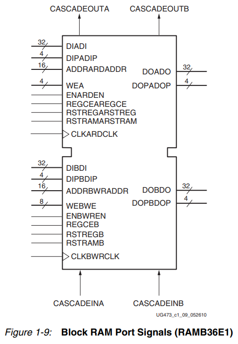

4-3 Verilog Instantiation Template
===

## Purpose

學習直接透過 Verilog 語法呼叫 Block BRAM

## Project flow

Lab 4-3 的範例較為簡單，主要會著重在 Verilog Template 的講解。

只需將 `src/top.v`、`src/shift.v`、`xdc/pynq-z2_v1.0.xdc` 加入 Project，並直接產生 Bitstream 燒錄做觀察即可。

## Verilog Template

主要分成兩個部分 : **Available Attributes** 、 **Port Descriptions**

- Available Attributes : 可設定 Block RAM 的操作模式、初始值、資料寬度等等參數。

- Port Descriptions : 定義 Block RAM 的 I/O Ports。

#### Code Architecture

```v
RAMB36E1 #(
  Available Attributes
)
RAMB36E1_inst (
  Port Descriptions
);
```

#### Available Attributes

|Attribute  |Type   |Allowed Values |Default  |Description  |
|-----------|-------|---------------|---------|-------------|
|DOA_REG, DOB_REG|DECIMAL|0, 1|0|Output Registers Options. A value of 1 enables the output registers to the RAM, which gives you quicker clock-to-out from the RAM at the expense of an added clock cycle of read latency.|
|INIT_A, INIT_B|HEX|36-bit HEX|All Zeros|Specifies the initial value on the port output after configuration.|
|INIT_00 to INIT_7F|HEX|256-bit HEX|All Zeros|Allows specification of the initial contents of the 32 Kb data memory array.|
|INIT_FILE|STRING|String representing file name and location|NONE|File name of file used to specify initial RAM contents.|
|INITP_00 to INITP_0F|HEX|256-bit HEX|All Zeros|Allows specification of the initial contents of the 4 Kb parity data memory array.|
|RAM_MODE|STRING|"TDP", "SDP"|"TDP"|Selects simple dual port (SDP) or true dual port (TDP) mode.|
|READ_WIDTH_A, READ_WIDTH_B, WRITE_WIDTH_A, WRITE_WIDTH_B|DECIMAL|0, 1, 2, 4, 9, 18, 36, 72|0|Specifies the desired data width for a read/write on port A/B, including parity bits. This value must be 0 if the port is not used. Otherwise, it should be set to the desired port width.|
|SRVAL_A, SRVAL_B|HEX|36 bit HEX|All zeros|Specifies the output value of the RAM upon assertion of the synchronous reset (RSTREG) signal.|
|WRITE_MODE_A, WRITE_MODE_B|STRING|"WRITE_FIRST", "NO_CHANGE", "READ_FIRST"|"WRITE_FIRST"|Note 1|

> **Note 1**
> Specifies output behavior of the port being written to.
> - "WRITE_FIRST" = written value appears on output port of the RAM
> - "READ_FIRST" = previous RAM contents for that memory location appears on the output port
> - "NO_CHANGE" = previous value on the output port remains the same  
> When RAM_MODE="SDP", WRITE_MODE can not be set to "NO_CHANGE". For simple dual port implementations, it is generally suggested to set WRITE_MODE to "READ_FIRST" if using the same clock on both ports and to set it to "WRITE_FIRST" if using different clocks.
> This generally yields an improved collision or address overlap behavior when using the BRAM in this configuration.


#### Port Descriptions

 

|Port       |Direction   |Width          |Function |
|-----------|-------     |---------------|---------|
|ADDRARDADDR<15:0>|Input|16|Port A address input bus/Read address input bus.|
|ADDRBWRADDR<15:0>|Input|16|Port B address input bus/Write address input bus.|
|CLKARDCLK|Input|1|Rising edge port A clock input/Read clock input|
|CLKBWRCLK|Input|1|Rising edge port B clock input/Write clock input.|
|DIADI<31:0>|Input|32|Port A data input bus/Data input bus addressed by WRADDR. When RAM_MODE="SDP", DIADI is the logical DI<31:0>.|
|DIBDI<31:0>|Input|32|Port B data input bus/Data input bus addressed by WRADDR. When RAM_MODE="SDP", DIBDI is the logical DI<63:32>.|
|DOADO<31:0>|Output|32|Port A data output bus/Data output bus addressed by RDADDR. When RAM_MODE="SDP", DOADO is the logical DO<31:0>.|
|DOBDO<31:0>|Output|32|Port B data output bus/Data output bus addressed by RDADDR. When RAM_MODE="SDP", DOBDO is the logical DO<63:32>.|
|ENARDEN|Input|1|Port A RAM enable/Read enable.|
|ENBWREN|Input|1|Port B RAM enable/Write enable.|
|REGCEAREGCE|Input|1|Port A output register clock enable input/Output register clock enable input (valid only when DO_REG=1).|
|REGCEB|Input|1|Port B output register clock enable (valid only when DO_REG=1 and RAM_MODE="TDP").|
|RSTRAMARSTRAM|Input|1|Synchronous data latch set/reset to value indicated by SRVAL_A. This signal resets port A RAM output when RAM_MODE="TDP" and the entire RAM output when RAM_MODE="SDP"|
|RSTRAMB|Input|1|Synchronous data latch set/reset to value indicated by SRVAL_B. Not used when RAM_MODE="SDP".|
|RSTREGARSTREG|Input|1|Synchronous output register set/reset to value indicated by SRVAL_A. This signal resets port A output when RAM_MODE="TDP" and the entire output port when RAM_MODE="SDP".|
|RSTREGB|Input|1|Synchronous output register set/reset to value indicated by SRVAL_B. Not used when RAM_MODE="SDP".|
|WEA<3:0>|Input|4|Port A byte-wide write enable. Not used when RAM_MODE="SDP". See User Guide for WEA mapping for different port widths.(p.39)|
|WEBWE<7:0>|Input|8|Port B byte-wide write enable/Write enable. See User Guide for WEBWE mapping for different port widths.(p.39)|


## Reference

[Vivado Design Suite 7 Series FPGA and Zynq-7000 SoC Libraries Guide](https://docs.xilinx.com/r/2021.2-English/ug953-vivado-7series-libraries)

> Page 555
