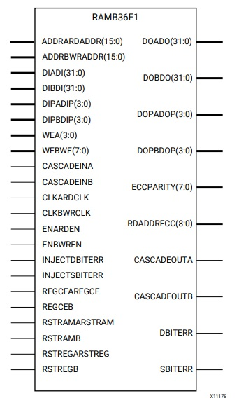

FPGA Design Lab4 - How to Utilize Embedded Block RAM on FPGA
=====

# Purpose

學習透過不同方式呼叫 PYNQ-Z2 上內建的 Block RAM - RAMB36E1

# Blcok RAM

Block RAM can be configured as :

- FIFOs

- 2 independent 18Kb blocks or a single 36Kb block RAM

- Simple Dual Port (SDP) / True Dual Port (TDP) are supported

# Lab

- 4-1 : 使用 Block RAM Generator 以及 AXI Bram Controller 這兩個 IP 來呼叫 Block RAM。

- 4-2 : 透過 Verilog code 來描述 Block RAM 的行為架構以在合成時呼叫 Block RAM。

- 4-3 : 直接使用 Xilinx Design Library 內的 Verilog Template 呼叫 Block RAM。

# Reference

[7 Series FPGAs Memory Resources User Guide](https://www.xilinx.com/support/documentation/user_guides/ug473_7Series_Memory_Resources.pdf)
