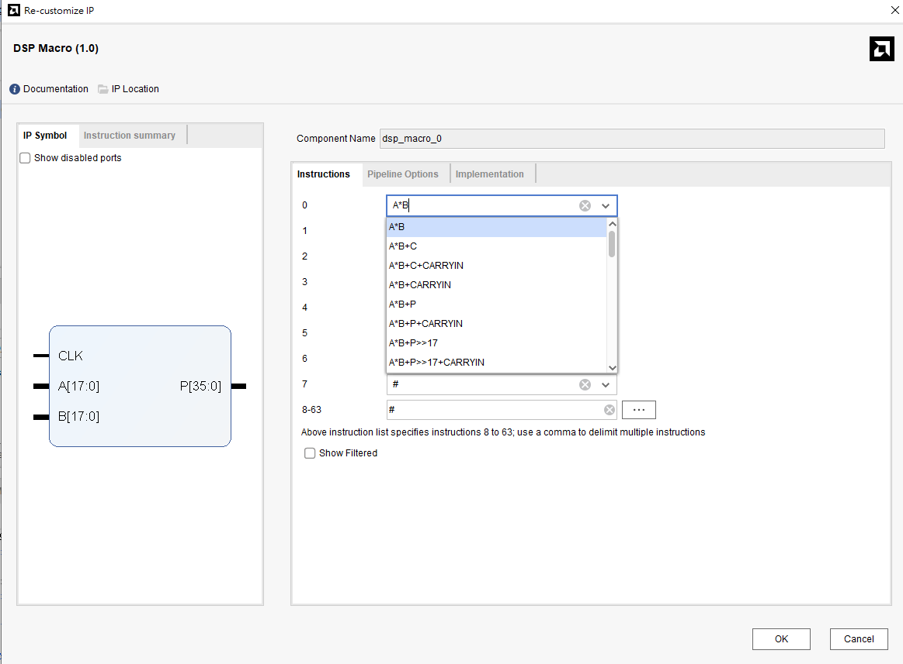
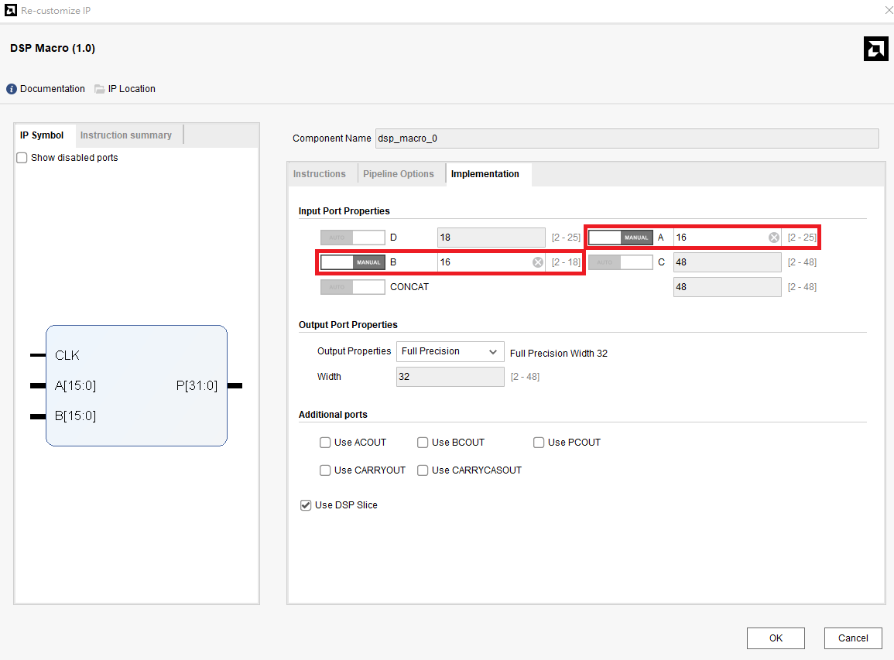
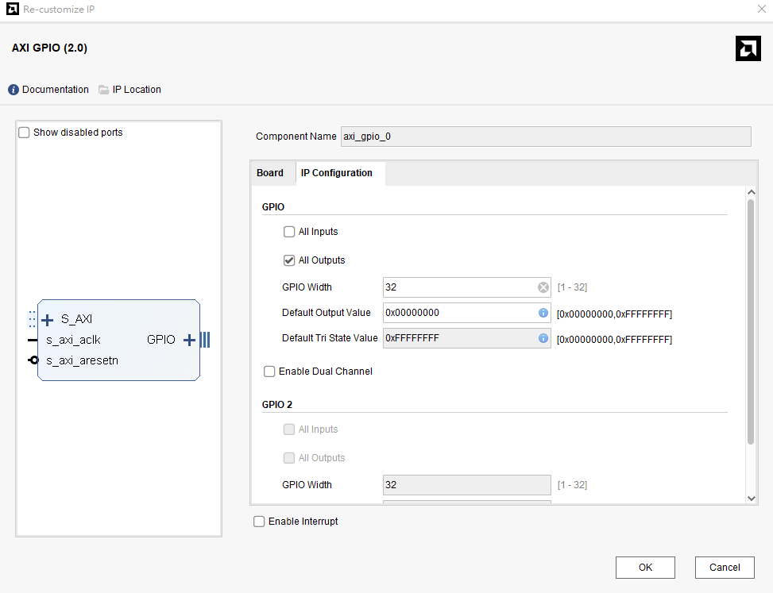
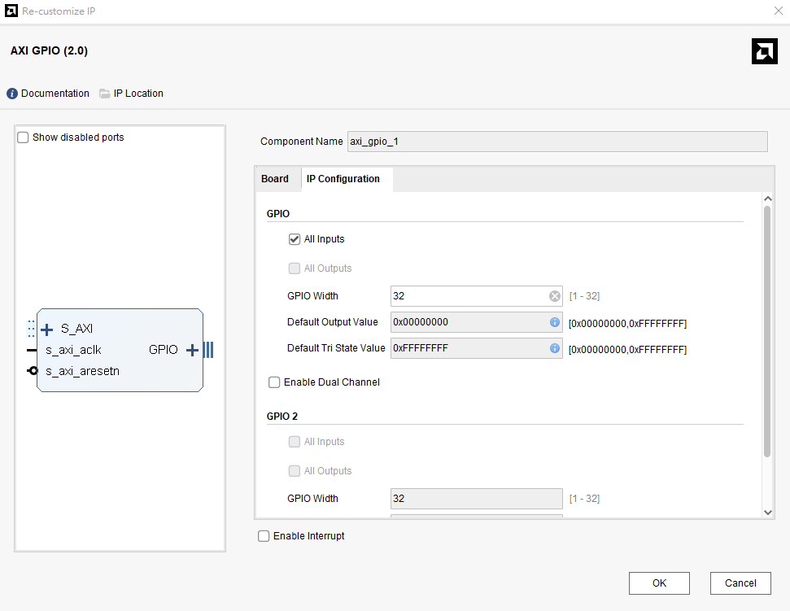
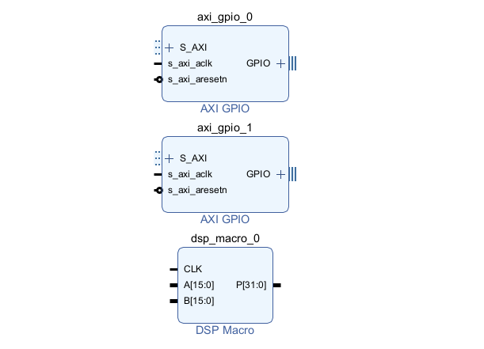
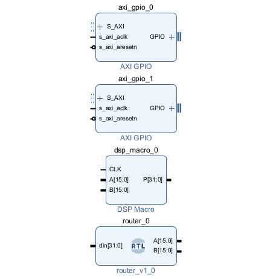
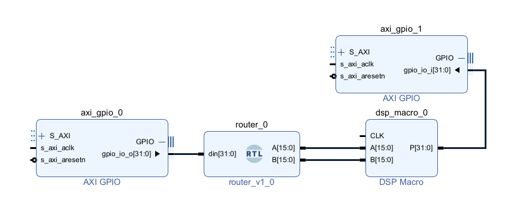
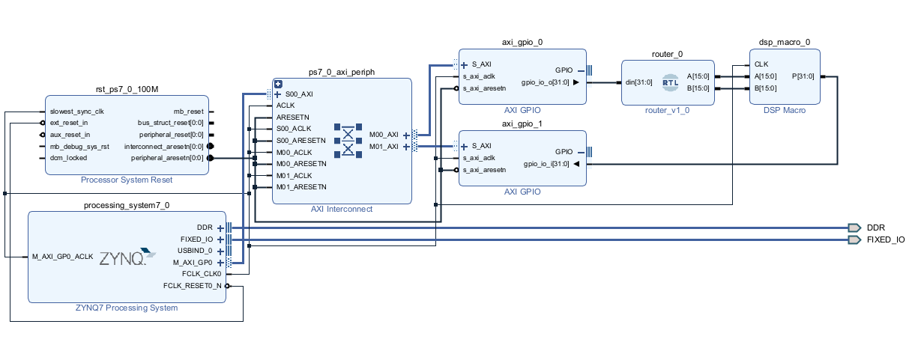
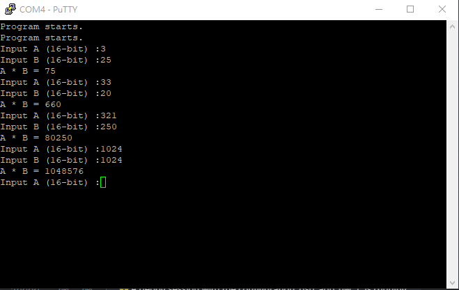

FPGA Design Lab5-1 - How to Use DSP Module with Block Design
===

# Purpose

使用 Block Design 的方式呼叫 DSP48E1 模組。

# Implementation Flow

建立一個專案，**路徑不能有空白**

完成後選擇 Create Block Design ，並加入 IP **DSP Macro**

在 IP 上左鍵雙擊進入 Re-customize IP 的頁面，先將 Instruction0 改成 `A * B`

接著到 Implementation 的頁面調整 I/O 的 data width 如圖

> 調整 A、B的寬度要先把左邊的 Auto 改成 Manual

加入一個 **AXI GPIO** 的 IP ， 作為與軟體端溝通的**輸入**，左鍵雙擊進入調整 IP 的頁面

再加入一個 **AXI GPIO** 的 IP ， 作為與軟體端溝通的**輸出**，左鍵雙擊進入調整 IP 的頁面

目前的 Block Design 應該會長這樣

接著使用 `Add Source`，加入 `/src/router.v` 作為 Input 32bit-16bit*2 的分線器

在空白區域 `右鍵` -> `Add Module` 選擇 `router.v`，完成後 Block Design 如下圖

接線如下圖

接著再加入 Zynq CPU，和之前 Lab 一樣做 `Block Automation`、`Connection Automation`

完成後如下圖

接著參照之前的 Lab，將 Block Design 轉換成 HDL Wrapper 後產生 bitstream，並 Export Hardware 後開啟 Vitis

開啟 Vitis 後和先前 Lab 一樣 Create Application Project、選擇剛匯出的 .xsa file.

建立專案後在專案內的 /src 資料夾加入 `/src/main.c`，接著 `build project`，並燒錄到 FPGA 上執行，並使用 PuTTy 驗證電路行為。

