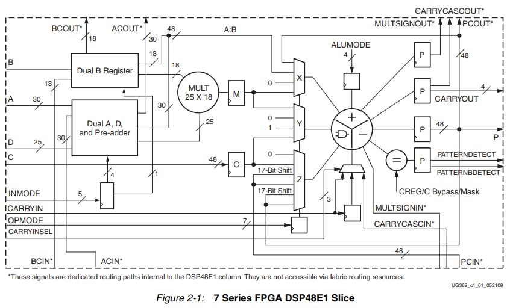
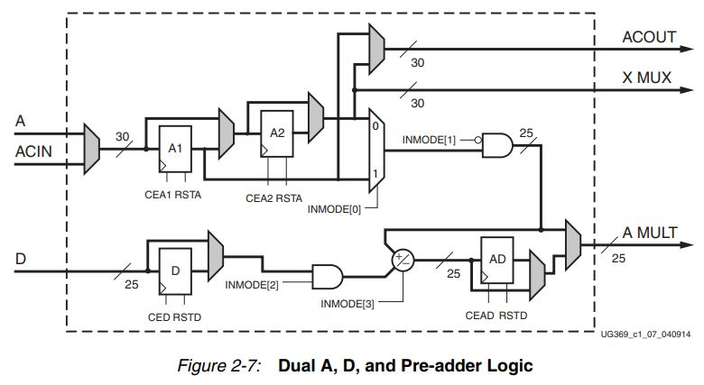
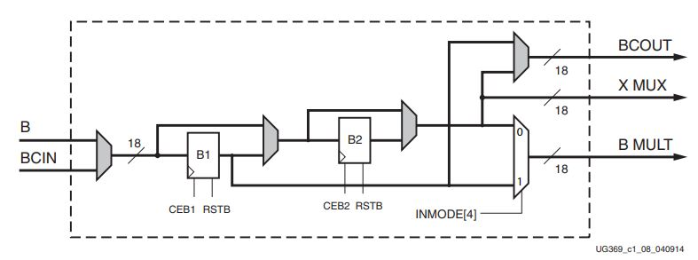
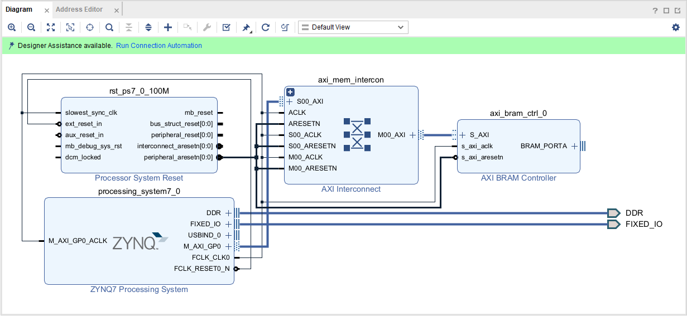
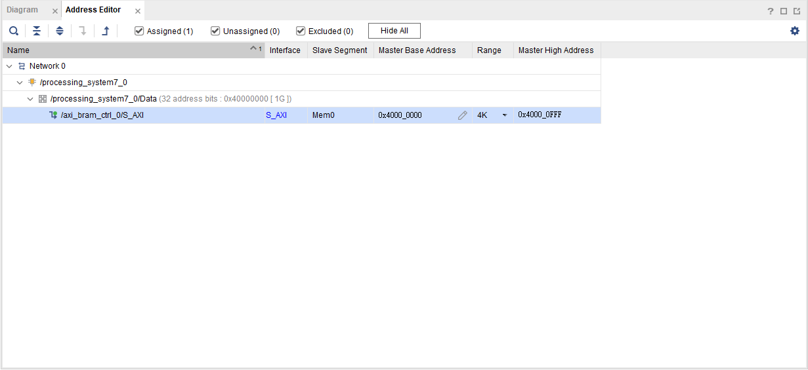
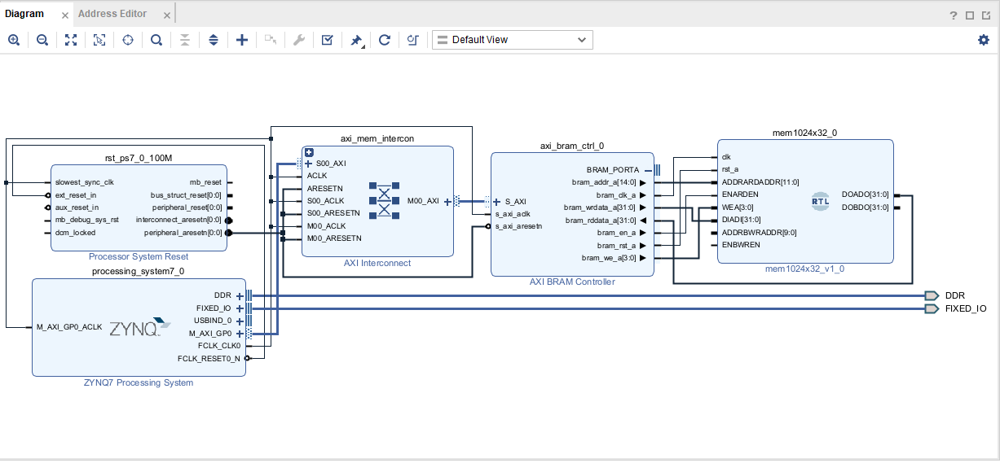
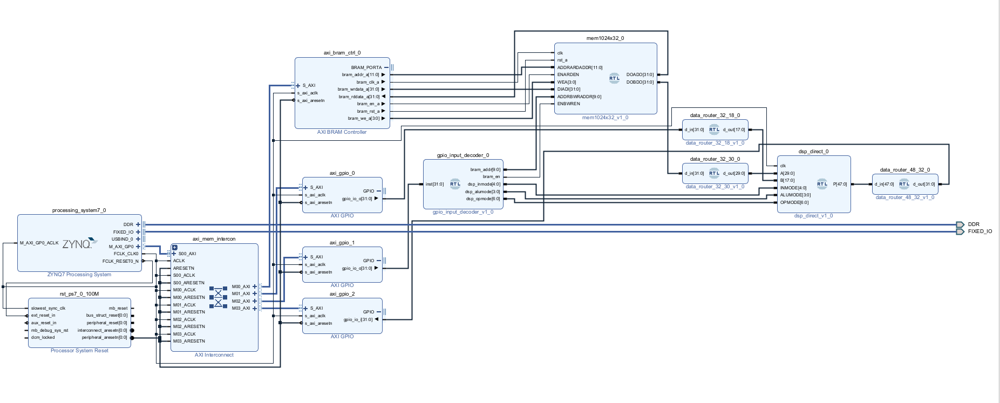

FPGA Design Lab5-2 - How to Use DSP Module with Verilog Template
===

# Purpose

學習使用 Verilog Template 來呼叫 DSP48E1 模組。



# Verilog Template

和 `RAMB36E1` 一樣，分為兩個部分 : **Available Attributes** 、 **Port Descriptions**

- Available Attributes : 可設定 DSP 的操作模式、Pipeline Regsiter的數量等等參數。

- Port Descriptions : 定義 DSP Mdoule 的 I/O Ports。

#### Code Architecture

```v
DSP48E1 #(
  Available Attributes
)
DSP48E1_inst (
  Port Descriptions
);
```

#### Available Attributes

##### Data Input Pipeline Selection

|Attribute  |Type   |Allowed Values |Default  |Description  |
|-----------|-------|---------------|---------|-------------|
|AREG|DECIMAL|1, 0, 2|1|Selects the number of A input pipeline registers.|
|ACASCREG |DECIMAL|1, 0, 2|1|Selects the number of A input registers on the A cascade path, ACOUT. This attribute must be equal to or one less than the AREG value. |
|BREG|DECIMAL|1, 0, 2|1|Selects the number of B input registers.|
|BCASCREG|DECIMAL|1, 0, 2|1|Selects the number of B input registers on the B cascade path, BCOUT. This attribute must be equal to or one less than the BREG value.|
|CREG |DECIMAL|1, 0|1|Selects the number of C input registers. |
|DREG|DECIMAL|1, 0|1|Selects the number of D input registers.|
|ADREG|DECIMAL|1, 0|1|Selects the number of AD pipeline registers.|
|CARRYINREG|DECIMAL|1, 0|1|Selects the number of CARRYIN input registers.|

- A(B)REG=0: A(B)CASCREG must be 0.
- A(B)REG=1: A(B)CASCREG must be 1.
- A(B)REG=2: A(B)CASCREG can be 1 or 2.

##### Control Input Pipeline Selection

|Attribute  |Type   |Allowed Values |Default  |Description  |
|-----------|-------|---------------|---------|-------------|
|ALUMODEREG|DECIMAL|1, 0|1|Selects the number of ALUMODE input registers.|
|CARRYINSELREG|DECIMAL|1, 0|1|Selects the number of CARRYINSEL input registers.|
|INMODEREG|DECIMAL|1, 0|1|Selects the number of INMODE input registers.|
|OPMODEREG |DECIMAL|1, 0|1|Selects the number of OPMODE input registers.|

##### Pattern Detector Attributes  
|Attribute  |Type   |Allowed Values |Default  |Description  |
|-----------|-------|---------------|---------|-------------|
|USE_PATTERN_DETECT|STRING|"NO_PATDET", "PATDET"|"NO_PATDET"|Selects whether the pattern detector and related features are used ("PATDET") or not used ("NO_PATDET").|
|PATTERN|HEX|48-bit HEX|All zeros |This 48-bit value is used in the pattern detector.|
|SEL_PATTERN|STRING|"PATTERN", "C"|"PATTERN"|Selects the input source for the pattern field. The input source can either be a 48-bit dynamic C input or a 48-bit static PATTERN attribute field.|
|MASK|HEX|48-bit HEX|All ones|This 48-bit value is used to mask out certain bits during a pattern detection. `Note1`|
|SEL_MASK|STRING|"MASK", "C", "ROUNDING_MODE1", "ROUNDING_MODE2"|"MASK"|Selects the mask to be used for the pattern detector.|

> Note1 :  
> - When a MASK bit is set to 1, the corresponding pattern bit is ignored.  
> - When a MASK bit is set to 0, the pattern bit is compared.


##### Other Attributes

|Attribute  |Type   |Allowed Values |Default  |Description  |
|-----------|-------|---------------|---------|-------------|
|A_INPUT|STRING|"DIRECT", "CASCADE"|"DIRECT" |Selects the input to the A port between parallel input ("DIRECT") or the cascaded input from the previous slice ("CASCADE").|
|B_INPUT|STRING|"DIRECT", "CASCADE"|"DIRECT" |Selects the input to the B port between parallel input ("DIRECT") or the cascaded input from the previous slice ("CASCADE").|
|MREG|DECIMAL|1, 0|1|Selects the number of multiplier output(M) pipeline register stages.|
|PREG|DECIMAL|1, 0|1|Selects the number of P output registers. The registered outputs will include: `CARRYOUT`, `CARRYCASCOUT`, `MULTSIGNOUT`, `PATTERNB_DETECT`, `PCOUT`.|
|USE_DPORT|BOOLEAN|FALSE, TRUE|FALSE|Determines whether the pre-adder and the D Port are used or not.|
|USE_MULT|STRING|"MULTIPLY", "DYNAMIC", "NONE"|"MULTIPLY"|Selects usage of the multiplier. Set to "NONE" to save power when using only the Adder/Logic Unit. The "DYNAMIC" setting indicates that the user is switching between A*B and A:B operations on the fly and therefore needs to get the worst-case timing of the two paths.|


#### Port Descriptions

|Port       |Direction   |Width          |Function |
|-----------|-------     |---------------|---------|
|A<29:0> |Input|30|Data input for pre-adder, multiplier, adder/subtracter/accumulator, ALU, or concatenation operations. `Note2`|
|ACIN<29:0>|Input|30|Cascaded data input from ACOUT of previous DSP48E1 slice (multiplexed with A). If not used, tie port to all zeros.|
|ACOUT<29:0>|Output|30|Cascaded data output to ACIN of next DSP48E1 slice. If not used, leave unconnected.|
|ALUMODE<3:0>|Input|4|Controls the selection of the logic function in the DSP48E1 slice.|
|B<17:0>|Inpupt|18|The B input of the multiplier. B[17:0] are the least significant bits (LSBs) of the A:B concatenated input to the second-stage adder/subtracter or logic function.|
|BCIN<17:0>|Input|18|Cascaded data input from BCOUT of previous DSP48E1 slice (muxed with B). If not used, tie port to all zeros.|
|BCOUT<17:0>|Output|18|Cascaded data output to BCIN of next DSP48E1 slice. If not used, leave unconnected.|
|C<47:0>|Input|48|Data input to the second-stage adder/subtracter, pattern detector, or logic function.|
|CARRYCASIN|Input|1|Cascaded carry input from CARRYCASCOUT of previous DSP48E1 slice.|
|CARRYCASCOUT|Output|1|Cascaded carry output to CARRYCASCIN of next DSP48E1 slice. This signal is internally fed back into the CARRYINSEL multiplexer input of the same DSP48E1 slice.|
|CARRYIN|Input|1|Carry input from the FPGA logic.|
|CARRYINSEL <2:0>|Input|3|Selects the carry source.|
|CARRYOUT<3:0>|Output|4|4-bit carry output from each 12-bit field of the accumulate/adder/logic unit. Normal 48-bit operation uses only CARRYOUT3. SIMD operation can use four carry out bits (CARRYOUT[3:0]).|
|CE~|Input|1|Active-High clock enable for the ~ pipeline register. Tie to logic one if the register is used. Tie to logic zero if the register is not used.|
|CLK|Input|1|The DSP48E1 input clock common to all internal registers and flip-flops.|
|D<24:0>|Input|25|25-bit data input to the pre-adder or alternative input to the multiplier.|
|INMODE<4:0>|Input|5|These five control bits select the functionality of the preadder, the A, B, and D inputs, and the input registers. These bits should be tied to all zeros if not used.|
|OPMODE<6:0>|Input|7|Controls the input to the X, Y, and Z multiplexers in the DSP48E1 slice dictating the operation or function of the DSP slice.|
|P<47:0>|Output|48|Data output from second stage adder/subtracter or logic function.|
|PATTERNBDETECT|Output|1|Active-High match indicator between P[47:0] and the pattern bar.|
|PATTERNDETECT|Output|1|Active-High Match indicator between P[47:0] and the pattern gated by the MASK.|
|PCIN<47:0>|Input|48|Cascaded data input from PCOUT of previous DSP48E1 slice to adder. If used, connect to PCOUT of upstream cascaded DSP slice. If not used, tie port to all zeros.|
|PCOUT<47:0> |Output| 48 |Cascaded data output to PCIN of next DSP48E1 slice. If used, connect to PCIN of downstream cascaded DSP slice. If not used, leave unconnected.|
|RST~|Input|1|Active-High synchronous reset for ~ pipeline registers. Tie to logic zero if not used.|

> Note2 :
> - When used with the multiplier or pre-adder, 25-bits of data (A[24:0]) is used and upper bits (A[29:25]) are unused and may be tied to ground.
> - When using the internal adder/subtracter/accumulator or ALU circuit, all 30-bits are used (A[29:0]).
> - When used in concatenation mode, all 30-bits are used and this constitutes the MSB (upper) bits of the concatenated vector.

# Control Signals

## INMODE<4:0> : Select the inputs of the 25x18 multiplier

#### INMODE[3:0] Functions (when AREG = 1 or 2)

|INMODE[3:0]|USE_DPORT|Multiplier A Port|
|:---:|:---:|:---:|
|0000|FALSE|A2|
|0001|FALSE|A1|
|0010|FALSE|Zero|
|0011|FALSE|Zero|
|0000|TRUE|A2|
|0001|TRUE|A1|
|0010|TRUE|Zero|
|0011|TRUE|Zero|
|0100|TRUE|D + A2|
|0101|TRUE|D + A1|
|0110|TRUE|D|
|0111|TRUE|D|
|1000|TRUE|-A2|
|1001|TRUE|-A1|
|1010|TRUE|Zero|
|1011|TRUE|Zero|
|1100|TRUE|D - A2|
|1101|TRUE|D - A1|
|1110|TRUE|D|
|1111|TRUE|D|



#### INMODE[4] Encoding (when BREG = 1 or 2)

|INMODE[4]|Multiplier B Port|
|:---:|:---:|
|0|B2|
|1|B1|



## OPMODE<6:0> : Select the outputs of the XYZ multiplexer

#### OPMODE Control Bits Select X Multiplexer Outputs

|Z / OPMODE[6:4] | Y / OPMODE[3:2] | X / OPMODE[1:0] | X Multiplexer Output | Notes |
|:---:|:---:|:---:|:---:|:---|
|xxx|xx|00|0|Default|
|xxx|01|01|M|Must select with OPMODE[3:2] = 01|
|xxx|xx|10|P|Must select with PREG = 1|
|xxx|xx|11|A:B|48 bits wide concatenation|

#### OPMODE Control Bits Select Y Multiplexer Outputs

|Z / OPMODE[6:4] | Y / OPMODE[3:2] | X / OPMODE[1:0] | Y Multiplexer Output | Notes |
|:---:|:---:|:---:|:---:|:---|
|xxx|00|xx|0|Default|
|xxx|01|01|M|Must select with OPMODE[1:0] = 01|
|xxx|10|xx|48'hFFFFFFFFFFFF|Used mainly for logic unit bitwise operations on the X and Z multiplexers|
|xxx|11|xx|C||

#### OPMODE Control Bits Select Z Multiplexer Outputs

|Z / OPMODE[6:4] | Y / OPMODE[3:2] | X / OPMODE[1:0] | Z Multiplexer Output | Notes |
|:---:|:---:|:---:|:---:|:---|
|000|xx|xx|0|Default|
|001|xx|xx|PCIN||
|010|xx|xx|P|Must select with PREG = 1|
|011|xx|xx|C||
|100|10|00|P|Use for MACC extend only. Must select with PREG = 1|
|101|xx|xx|17-bit Shift (PCIN)||
|110|xx|xx|17-bit Shift (P)|Must select with PREG = 1|
|111|xx|xx|xx|Illegal selection

## ALUMODE<3:0> : Control the functions of the adder/subtracter/logic unit

#### Three-Input ALUMODE operations

|DSP Operation|OPMODE[6:0]|ALUMODE[3:0]|
|:---|:---|:---:|
|Z + X + Y + CIN|Any Legal OPMODE|0000|
|Z - (X + Y + CIN)|Any Legal OPMODE|0011|
|-Z+(X+Y+CIN)-1 = not(Z) + X + Y + CIN|Any Legal OPMODE|0001|
|not(Z + X + Y + CIN) = -Z - X - Y - CIN - 1|Any Legal OPMODE|0010|

#### Two-Input ALUMODE operations

|Logic Unit Mode|OPMODE[3:2]|ALUMODE[3:0]|
|:---|:---:|:---:|
|X XOR Z|00|0100|
|X XNOR Z|00|0101|
|X XNOR Z|00|0110|
|X XOR Z|00|0111|
|X AND Z|00|1100|
|X AND (NOT Z)|00|1101|
|X NAND Z|00|1110|
|(NOT X) OR Z|00|1111|
|X XNOR Z|10|0100|
|X XOR Z|10|0101|
|X XOR Z|10|0110|
|X XNOR Z|10|0111|
|X OR Z|10|1100|
|X OR (NOT Z)|10|1101|
|X NOR Z|10|1110|
|(NOT X) AND Z|10|1111|

## CARRYINSEL<2:0> : Selects the carry-in source of the adder/subtracter/logic Unit

#### CARRYINSEL Control Carry source

|CARRYINSEL[2:0]|Select|Notes|
|:---:|:---|:---|
|000| CARRYIN |General interconnect|
|001| ~PCIN[47]| Rounding PCIN (round towards infinity)
|010| CARRYCASCIN| Larger add/sub/acc (parallel operation)
|011| PCIN[47]| Rounding PCIN (round towards zero)
|100| CARRYCASCOUT| For larger add/sub/acc (sequential operation via internal feedback). Must select with PREG = 1
|101|~P[47] |Rounding P (round towards infinity). Must select with PREG = 1
|110|A[24]| XNOR B[17] Rounding A x B
|111|P[47]|For rounding P (round towards zero). Must select with PREG = 1

# Lab Project

### Purpose

A Simple Software-Harware Co-Design Example

### Implementation Flow

建立一個 Vivao Project，先將 `src/hdl/` 內的 `mem1024x32.v`, `dsp_direct.v`, `gpio_input_decoder.v`, `data_router_32_30.v`, `ata_router_32_18.v`, `data_router_48_32.v` 加到 Project 中。

接著建立一個 Block Design，加入 Zynq processor 和 AXI BRAM Controller 兩個 IP。

將 BRAM Controller 調整為 AXI4LITE 以及只剩 Port A 後，先做 Zynq Processor 的 Block Automation 以及 Zynq Processor 與 BRAM Contorller 的 AXI Connect Automation 如下圖。



接著到上方 Address Editor 修改 BRAM Controller 的 Addresss Range 為 4K (Byte)



`右鍵` -> `Add Module` -> 加入 `mem1024x32.v` 並與 BRAM Controller 連接如下圖



`Add IP` -> 加入三個 AXI GPIO ，兩個設定為 All outputs 作為控制訊號以及 DSP B Port Input，一個設定為 All Inputs 以讀取 DSP 運算結果

接著將剩下的 Modules 加入連接如下圖



> 連接完可用 Validate Design 做初步檢查

接著一樣 `Create HDL Wrapper` -> `Generate Bitstream` -> `Export Hardware` -> `Launch Vitis IDE`

執行 `/src/main.c` 觀察運算結果
