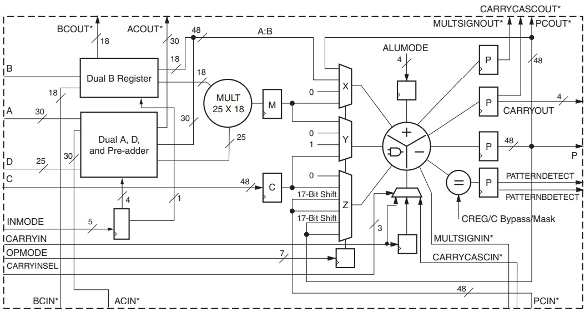
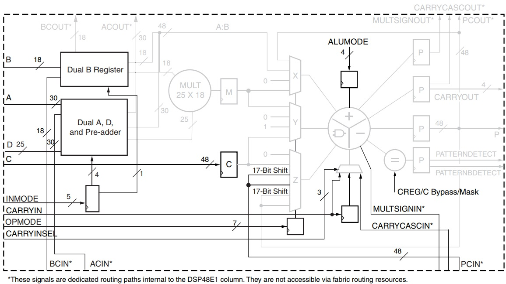
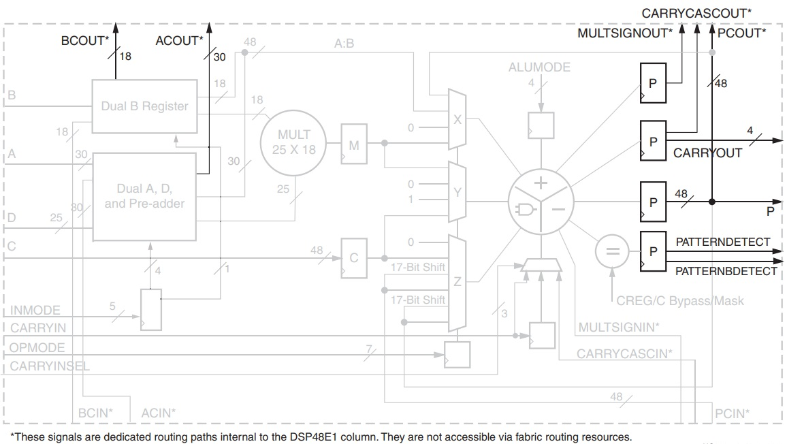
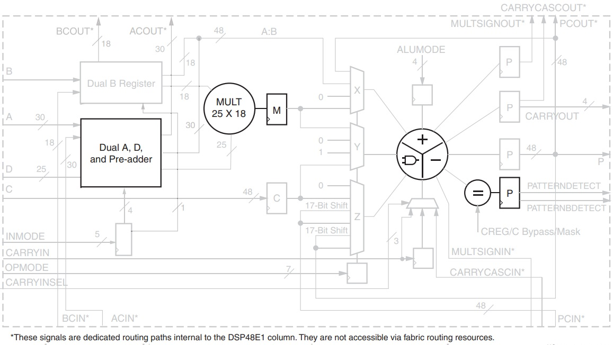

FPGA Design Lab5 - How to Use DSP Module
===

## Purpose

學習透過兩種方式來呼叫並使用 DSP 模組。

## DSP48E1

An embedded computing module on FPGAs, functions include :

- 25 × 18 two’s-complement multiplier

- 48-bit accumulator

- Optional pipelining

- Power saving pre-adder

-  Single-instruction-multiple-data (SIMD) arithmetic unit

- Optional logic unit

- Pattern detector

## Architecture

### Input Ports

- A, B, C, D are the direct input data ports.

- ACIN, BCIN, PCIN, CARRYCASIN, MULTSIGNIN are the cascade input data ports from the previous DSP48E1 slice.

- INMODE is the control signal selecting the sources of the 25x18 2's copmplement multiplier.

- OPMODE is the control signal selecting the outputs of X, Y, Z multiplexers (The inputs of the logic unit).

- ALUMODE is the control signal determining the operation of the logic unit.  

### Output Ports

- P, CARRYOUT, PATTERNDETECT, PATTERNBDETECT are the direct output data ports.

- ACOUT, BCOUT, PCOUT, CARRYCASOUT, MULTSIGNOUT are the cascade output data ports to the next DSP48E1 slice.

### Embedded Functions

- Pre-adder

- 2's Complement Multiplier

- Adder/Substracter/Logic Unit

## Reference

[7 Series DSP48E1 Slice User Guide (UG479)](https://www.xilinx.com/support/documentation/user_guides/ug479_7Series_DSP48E1.pdf)

[Vivado Design Suite 7 Series FPGA and Zynq-7000 SoC Libraries Guide](https://docs.xilinx.com/v/u/2020.1-English/ug953-vivado-7series-libraries)

> P.305 - P.314
