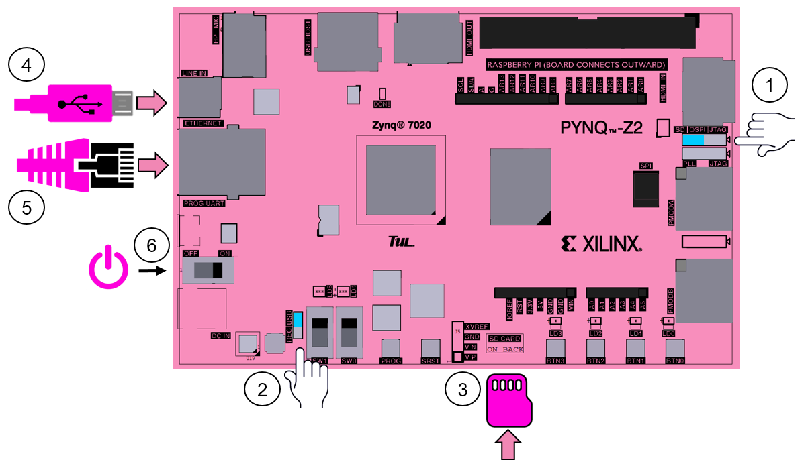

FPGA Design Lab6 - Python + Zynq = PYNQ
===

## Purpose

學習使用 Python 控制 FPGA，實現軟硬體共同開發。

## Set Up The Board

根據上圖調整板子上的設定：

1. 將開機模式調整至 `SD` 的位置。

2. 調整電源供應模式 (使用電源供應器就接 `REG`；使用 USB 供電就接 `USB`)。

3. 插入 micro SD。

4. 接上電源。

5. 插上乙太網路線，另一端與筆電連接。  
    > 若你的電腦是連接路由器有現成的區域網路可以使用，則將 FPGA 與路由器連接，待會跳到 Step2 ver2

6. 開機。  
    開啟電源後先不要動作，等待板子的 RGB LED 閃彩燈後四顆 LED 全亮紅燈/綠燈才代表完全開機完成。

7. 打開 PuTTY 連結FPGA即可看到 Linux 系統的 terminal 的畫面。

## Step 2 - Connect to the Board ver1

1. `開啟網路和共用中心` -> `變更介面卡設定` -> `乙太網路` -> `內容` -> `IPv4` -> `內容`

  將 IP 位置設定為 `192.168.2.1`

  將 子網路遮罩設定為 `255.255.255.0`

2. 在檔案總管輸入 `\\192.168.2.99\xilinx`，輸入帳號密碼皆為 `xilinx`，連線的上即代表有開機連線成功。

## Step 2 - Connect to the Board ver2

其實不用特別設定什麼，在檔案總管輸入 `\\192.168.2.99\xilinx`，輸入帳號密碼皆為 `xilinx`，連線的上即代表有開機連線成功。

## Preparation

這次使用 Lab 5-2 的範例，使用 7zip 或是 WinRAR 等壓縮程式開啟xsa檔，將裡面的 `design.bit` 和 `design.hwh` 兩個檔案提取出來。

而這次 lab 已經將需要的檔案都放在`Lab6_example`內了，直接將整個資料夾複製到 `\xilinx\jupyter_notebooks`內。

## Jupyter Notebook

1. 打開瀏覽器，輸入位址: `192.168.2.99:9090` (預設密碼也是xilinx)

2. 打開 `/Lab6_example/lab6.ipynb`

3. 接續說明在 jupyter notebook 內部。

## Reference

[Python producivity for Zynq](https://pynq.readthedocs.io/en/v2.7.0/index.html#)

[Set up the PYNQ-Z2 board from TUL to run PYNQ (YouTube)](https://www.youtube.com/watch?v=RiFbRf6gaK4)
