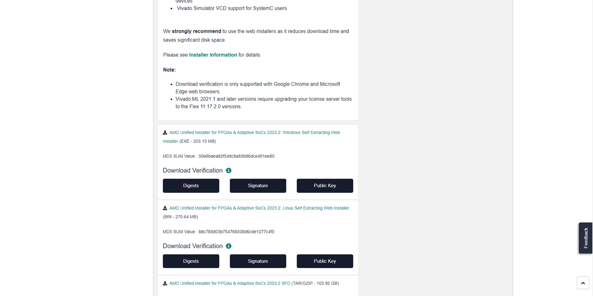
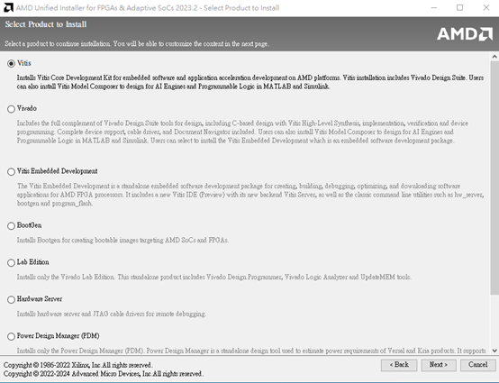
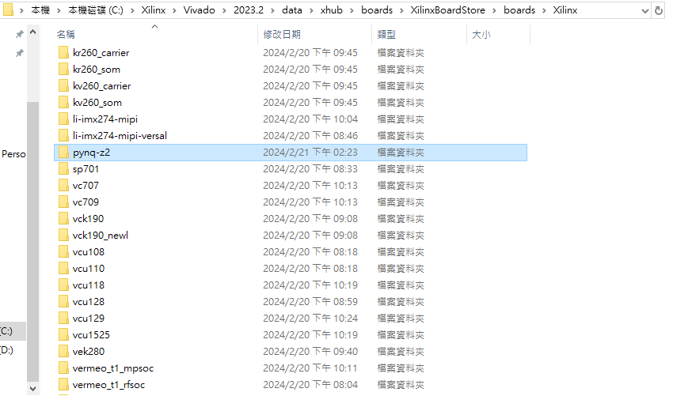

Vivado Installation Tutorial
============================

# Part 1 - Vivado Installation

1. 前往[AMD](https://www.amd.com/en.html)，註冊一個帳號。

2. 前往[這裡](https://www.xilinx.com/support/download.html)，下載 **Vivado 2023.2**

  **註：請安裝在使用者名稱為 "英文" 的電腦**

3. 登入後選擇版本。

4. **!!重要!!** 安裝路徑不可以有中文！

# Part 2 - PYNQ Board File Set up

## PYNQ Z2

這門課所使用的板子為 PYNQ-Z2，[官網](https://www.tul.com.tw/)有提供此板子的 [board file](https://dpoauwgwqsy2x.cloudfront.net/Download/pynq-z2.zip)。下載解壓縮後，將整個資料夾放到 Vivado 安裝目錄裡的 board_files 資料夾底下   

路徑 : _"C:\Xilinx\Vivado\2023.2\data\xhub\boards\XilinxBoardStore\boards\Xilinx"_

執行此動作後須重新開啟 Vivado 才會出現此板子的選項
